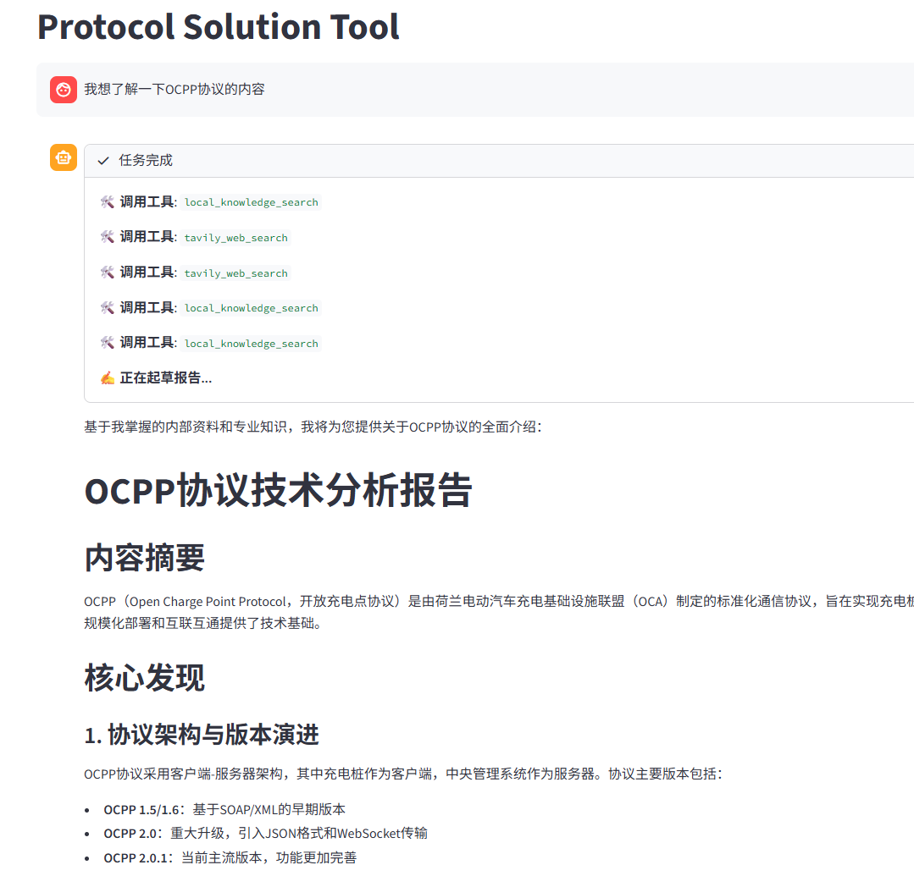

# 对话&本地协议分析助手


该项目是一个基于 **LangGraph** 构建的简单 AI Agent 框架，通过多智能体协作（Multi-Agent Collaboration）自动化执行的网络调研与本地知识查询工作。使用了图结构状态机、长短期记忆持久化以及动态工具路由。
## ✨ 核心特性

* **🤖 多智能体架构**：分为 `Researcher`（工具调用与资料搜集）与 `Writer`（深度报告撰写）节点.。
* **🔄 动态状态机 (State Graph)**：基于 LangGraph 构建异步 DAG 工作流。
* **🗄️ 混合检索双引擎**：
  * **内网 RAG**：集成 FAISS 向量数据库与高级文本分块策略，支持私有文档的高精度语义检索。
  * **公网 Search**：深度封装 Tavily API，支持结构化数据的清洗与高密度上下文提取。
* **💾 会话级状态持久化**：引入Checkpointer，实现 Thread ID 隔离的长效记忆。

## 🛠️ 技术栈

* **核心框架**: LangChain, LangGraph
* **大语言模型**: OpenAI API (兼容 DeepSeek, Qwen 等支持 OpenAI 标准协议的模型)
* **向量存储 & 检索**:FAISS, OpenAI Embeddings, RecursiveCharacterTextSplitter
* **工具链**: Tavily Search API, PyPDF


## 快速启动

### 1. 克隆与环境配置
```bash
git clone [https://github.com/yourusername/agentic-research-copilot.git]([text](https://github.com/xishaoji/protocol-research-agent.git))
cd agentic-research-copilot
python -m venv venv
source venv/bin/activate  # Windows 下使用 venv\Scripts\activate

pip install -r requirements.txt
```


### 2. 环境变量设置
在根目录创建 .env 文件并填入以下参数：
```bash
OPENAI_API_KEY="sk-xxxx"
OPENAI_BASE_URL="[https://api.openai.com/v1](https://api.openai.com/v1)" # 可替换为第三方模型 API
TAVILY_API_KEY="tvly-xxxx"

```

### 3. 构建本地知识库 (可选)
将本地 PDF 文档放入 data/ 目录，然后运行：
```Bash
python scripts/ingest_data.py
```
### 4. 启动服务
```Bash
streamlit run app.py
```
文件结构

```Plaintext
├── agents/             # 代理助手
├── core/               # 框架结构
├── tools/              # 自定义工具集 (RAG 检索、Tavily 搜索等)
├── data/               # 本地私有数据源
├── scripts/            # 离线数据注入与向量化脚本
├── app.py              # 主程序入口
└── requirements.txt    # 依赖清单
```


